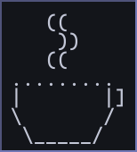

# I'm Yami 👋

in my 20s, based in Germany, self-taught full-stack developer.
 
You can find me here and there dabbling in code.

Don't try to look for relation between my projects, there isn't any.

This is a personal github account so I don't commit to it often.

 

 

[&langs_count=6&theme=dark)](https://wakatime.com/@Yamikhal)

*Note: I'll remove Top Languages once WakaTime has enough data. I've been using it since July 10, 2026.*
